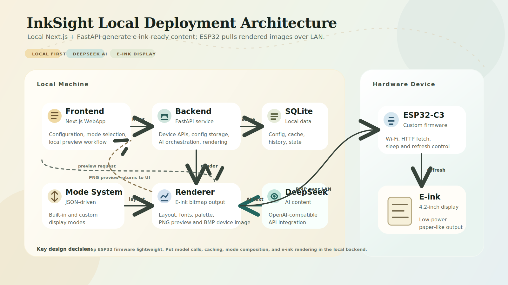
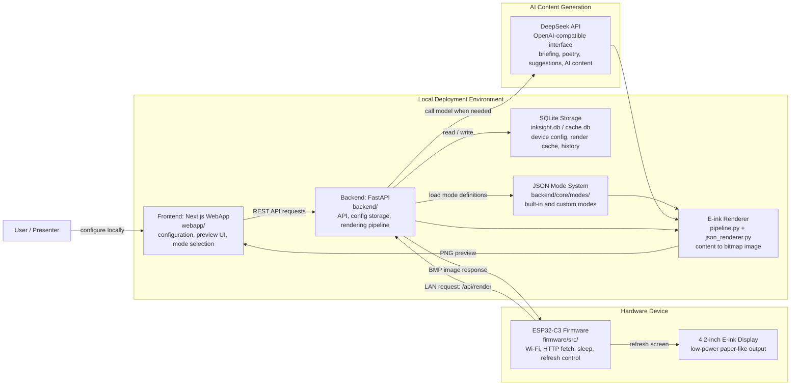

# InkSight Local Deployment Project Structure

## PPT-ready SVG

Use this file directly in slides:

- `docs/project-structure-local-deploy.svg`

## Editable Mermaid Version

## Short Talk Track

InkSight is deployed as a local end-to-end system. The Next.js frontend and FastAPI backend both run on the local machine. The frontend is used for configuration and preview, while the backend owns device configuration, mode loading, AI content generation, caching, and e-ink image rendering.

DeepSeek is integrated through an OpenAI-compatible API and is called by the backend only when a mode needs AI-generated content. The ESP32-C3 firmware stays lightweight: it connects to Wi-Fi, requests the rendered bitmap from the local backend over LAN, and refreshes the e-ink display.
